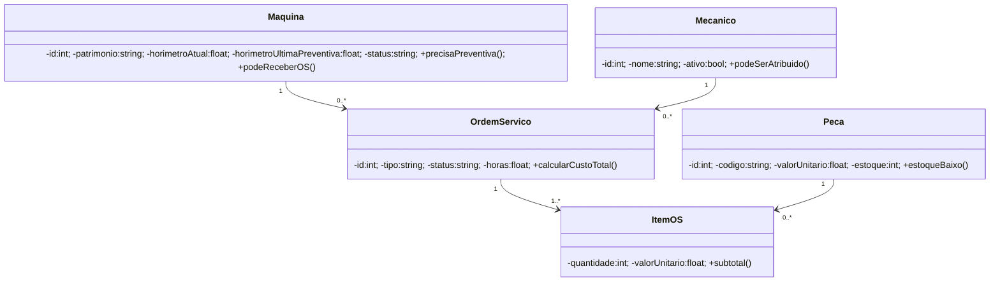

# AgroMec — Modelagem

## Casos de uso
**Ator:** Gerente.

- RF01 Autenticar login
- RF02 Gerenciar máquinas
- RF03 Gerenciar mecânicos
- RF04 Gerenciar peças/estoque
- RF05 Abrir OS
- RF06 Adicionar itens à OS
- RF07 Alterar andamento/concluir/cancelar OS
- RF08 Consultar OS
- RF09 Visualizar alertas de preventiva
- RF10 Emitir relatório de custos
- RF11 Buscar máquina por patrimônio

Relação: **Abrir OS** «include» **Validar máquina e mecânico**. **Concluir OS** «include» **Calcular custo total**.

## Diagrama de classes (Mermaid)

